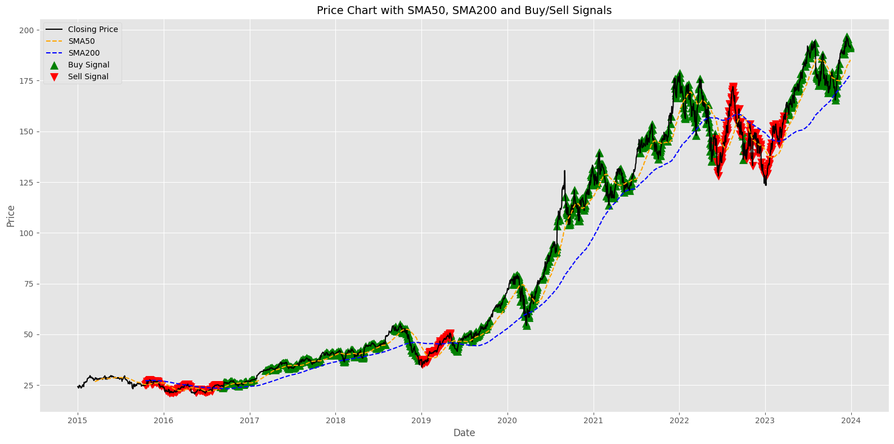

# 📈 Technical Trading Strategy Simulator (SMA + RSI)

A backtesting project that simulates a trading strategy using real historical stock data and key technical indicators — **SMA50, SMA200, and RSI**.

This project mimics how quantitative analysts make trading decisions and evaluate strategies before using them in the real world.

---

## 📦 Dataset Used

- ✅ Source: Yahoo Finance (`yfinance` API)
- ✅ Ticker: **Apple Inc. (AAPL)**
- ✅ Time period: **January 2015 to January 2024**
- ✅ Frequency: **Daily closing prices**

This stock was chosen for its high liquidity and volatility — perfect for testing technical strategies.

---

## 🚀 Features

✅ Download real-time stock data using `yfinance`  
✅ Calculate SMA50 and SMA200 for trend analysis  
✅ Use RSI (Relative Strength Index) for momentum filtering  
✅ Generate buy/sell signals based on indicator crossovers  
✅ Simulate capital growth with trade-by-trade profit tracking  
✅ Plot clean charts showing closing price, SMA lines, and signals  

---

## 🛠️ Tools & Libraries

- Python
- pandas
- numpy
- matplotlib
- yfinance

---

## 📊 Strategy Logic

| Condition                      | Action     |
|-------------------------------|------------|
| SMA50 > SMA200 and RSI < 70   | 🔼 Buy      |
| SMA50 < SMA200 and RSI > 30   | 🔽 Sell     |

- Start with ₹10,000 capital  
- Buy only if not holding a position  
- Sell only if already holding  
- Track each trade's profit and total returns  

---

## 📈 Visual Output

> Annotated signals make it easy to interpret market behavior.


---

## 📁 Project Structure

```
sma-rsi-trading-bot/
│
├── trading_strategy.ipynb     ← Main notebook (Colab)
├── README.md                  ← Project overview
├── requirements.txt           ← Libraries used 
```

---

## 📌 Future Improvements

- 🔍 Add sentiment analysis using news headlines (`TextBlob`)
- 📉 Add risk metrics like Sharpe ratio, drawdown, win rate
- 📊 Add interactive dashboard with Streamlit or Plotly
- 💬 Allow user input for custom stocks and time ranges

---

## 🧠 What I Learned

- How to implement and backtest a real-world trading strategy  
- How technical indicators influence market decisions  
- How to simulate profit/loss and manage trades in code  
- How to visualize complex data cleanly and informatively

---

## 💡 Example Result

```
BUY at ₹24.36 on 2016-08-30
SELL at ₹37.44 on 2018-12-26 → Profit: ₹13.08
BUY at ₹49.87 on 2019-05-06
SELL at ₹143.08 on 2022-06-03 → Profit: ₹93.21
BUY at ₹148.60 on 2022-09-26
SELL at ₹138.07 on 2022-10-07 → Profit: ₹-10.53
BUY at ₹157.14 on 2023-03-23
FORCED SELL at ₹191.13 on 2023-12-29 → Profit: ₹33.99

Final capital: ₹10129.76
Total completed trades: 4
Total Profit: ₹129.76 
```

---

## 📬 Connect

📧 Email: eegasai@gmail.com  
🔗 LinkedIn: [Saikumar.In](www.linkedin.com/in/saikumar-eega) 

---

> ⚡ Built as a learning project to apply data analysis and finance together — and it turned out to be a powerful trading simulator!
"# sma-rsi-trading-bot" 
